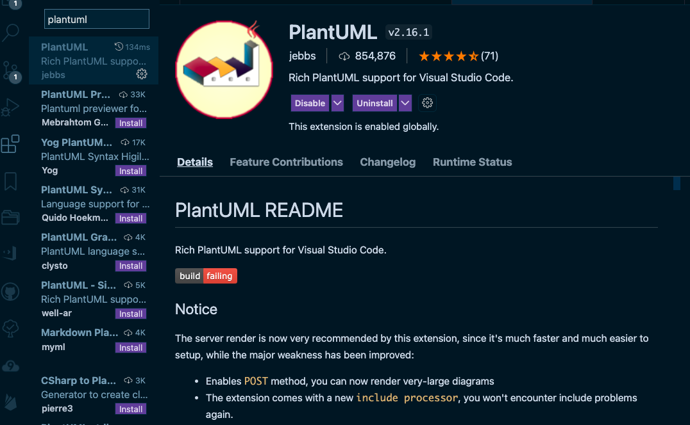
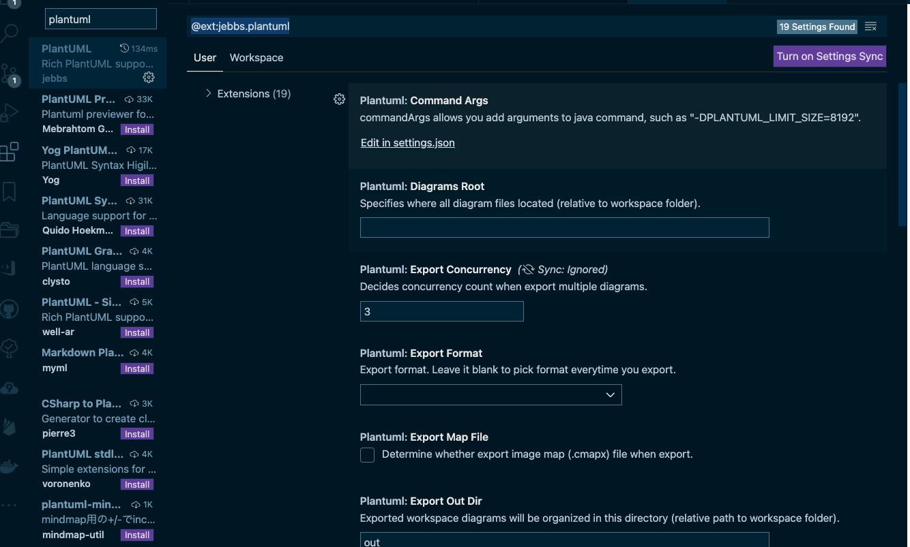
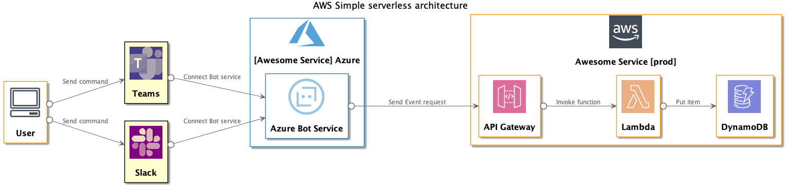
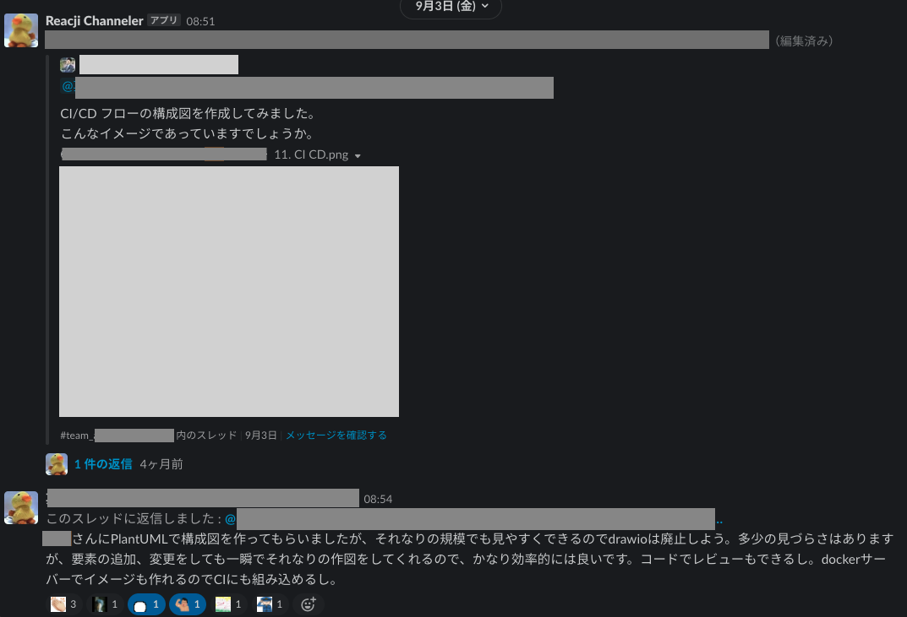

# 長く維持されるシステム構成図のつくりかた 〜 PlantUML で継続的に AWS/GCP/Azure アーキテクチャ図をメンテする仕組み 〜

本記事は株式会社 [Works Human Intelligence](https://www.works-hi.co.jp/) の [アドベントカレンダー](https://qiita.com/advent-calendar/2021/advent-works-hi) の 20 日目の記事となります。

昨日は @h53 さんの [情報処理安全確保支援士試験（SC）合格体験記](https://qiita.com/h53/items/c3867ee6194663f19284) でした。

## はじめに

本記事は株式会社 [Works Human Intelligence](https://www.works-hi.co.jp/) の [アドベントカレンダー](https://qiita.com/advent-calendar/2021/advent-works-hi) の 20 日目の記事となります。

みなさん、構成図描いていますか？

システム開発をするうえで構成図は欠かせない存在です。
特に昨今はクラウドサービスの利用が当たり前となってきており、どのようなクラウドサービスを活用して設計を行うかを議論する上で、構成図の価値は高まっていると感じます。

最近おもしろいと思ったのは、AWS Dev Day で決勝戦が行われていた「AWS Women’s Well-Architected ハッカソン（[ダイジェストムービーリンク](https://www.youtube.com/watch?v=tgy_PDKvEog)）」です。
構成図があればハッカソンだってできるんだなぁと。

しかし構成図を筆頭にドキュメントは廃れやすいものです。
構成図はもちろん、ドキュメントは保守されてこそ価値を発揮するものです。
この記事では、私が新規サービス開発で実践しているシステム構成図の作成方法・メンテ方法について紹介させていただきます。

## システム構成図（アーキテクチャ図）とは

言わずもがなですが、前提を確認しておくと「システムの全体像を可視化したもの」です。

- どのビジネスロジックをどこでコンポーネントで実行しているのか
- どういったクラウドサービスを利用しているのか
- リクエストはどこからどの境界をまたいで飛んでくるのか

といったことなどを表現する役割を持っていると考えています。

## システム構成図のメリット

あまり MECE にまとまっていませんが、以下のようなことがシステム構成図のメリットに挙げられるのではないでしょうか。

- 現状の可視化
  - 現在の開発状況を俯瞰できる
  - 未来の状態を共有できる
- 議論の材料
  - 境界などを可視化することでセキュリティなどの改善ポイントについて議論しやすくなる
- 理解の容易化
  - 新しいチームメンバーが加わったときに理解の助けとなる
  - リクエストの流れを追うことでトラブル発生時のトラブルシューティングなどにも役立つ
- 外部への情報提供
  - ユーザーや監査会社などへの情報開示の材料にできる

どれも「情報の共有」という本質は変わらないのですが、システム構成図が一枚あるだけで多くのステークホルダーにメリットを与えることができます。
私が今年携わった新規開発でも、設計、特にセキュリティの観点で大きな瑕疵はないかを他者にレビューしてもらうため、まずはアーキテクチャ図の作成を優先しました。
自分で本格的にシステム構成図をするのは初めてだったので時間がかかりましたが、ここに力を入れたことでアーキテクチャレビューを有効に活用できました。
またシステム構成図を開発時の羅針盤として活用することで開発者とレビュアーの認識の差異を少なくし、大きな手戻りを防ぐことに貢献しています。

## 構成図作成方法

手書きで作成する人もいるかもしれませんが、今の御時世だと何らかのツールを使って作成する人が多いと思います。
以下のような選択肢があります。

### 手動

#### Excel・PowerPoint

一度は誰もが通った道ではないのでしょうか。
構成図を作成することにフォーカスした支援機能はありませんが、多くの人、特に非開発部門の人も含めて利用できる可能性が一番高いツールです。
AWS では以下のようなパワポ向けのアイコンセットも提供されています。

- [AWS アーキテクチャアイコン](https://aws.amazon.com/jp/architecture/icons/)

ただ、継続的にメンテナンスをするうえでは辛いので、「これしか利用できない」という事情がない場合は専用のツールを使ったほうがいいでしょう。

#### オンライン作図ツール（diagrams.net, cacoo, etc）

[diagrams.net](https://www.diagrams.net/)（旧 draw.io）や [cacoo](https://cacoo.com/ja/) といったオンライン作図ツールです。
私の周りでは diagrams.net を利用して構成図を作成している人がダントツで多い気がします。
オンライン上で作成できるのはもちろん、[Visual Studio Code の拡張機能](https://marketplace.visualstudio.com/items?itemName=hediet.vscode-drawio) なども提供されています。
操作方法も直感的で特にキャッチアップを要せずとも描き始めることができます。
そして非常にキレイな構成図を作成することができます。

しかし、複雑な図になればなるほどメンテナンスは煩雑な作業になってきます。
それが一度ならいいですが、仕様変更が連続して起きたときはストレスフルな作業になることが予想できます。

#### その他

以下によくまとまっているので、参照してみてください。

- [結局 UML とかシーケンス図とか AWS の図とかどれで描くと良いのよ？と思ったときの選択肢 - Qiita](https://qiita.com/e99h2121/items/eaca084ae7b0488ab686)

### 自動

自動で構成図を作成してくれるツールもあるようです。
ただし人間が理解しやすいかという観点でいうと、まだまだの印象です。
抜け漏れなく構成を描き出してくれるため、設計に対する実装漏れがないかどうかをチェックするなどの用途には使えそうな気がしています。
たとえば、AWS 関連だと以下のようなツールがあります。

#### AWS Perspective

- [AWS アーキテクチャー図 構成図を自動生成するソリューションを紹介します | DevelopersIO](https://dev.classmethod.jp/articles/gettingstart-aws-perspective/)

#### CDK-Dia

- [CDK で構築した AWS 環境の構成図を自動生成するツール「CDK-Dia」を検証してみた | DevelopersIO](https://dev.classmethod.jp/articles/automated-diagrams-tool-cdk-dia/)

## そこで PlantUML

上記で見てきたツールは様々なメリットがありました。
しかし「ドキュメントを廃れさせない」という観点においてはどれも課題をもっています。
そこで [PlantUML](https://plantuml.com/ja/) の登場です。

PlantUML は、シンプルなテキストファイルで様々なダイアグラムを描くことができます。
そのなかでも今回はアーキテクチャ図にフォーカスします。

### メリット

以下のようなメリットが挙げられます。

- Markdown ベースで書くことができ、習得が比較的容易である
- 自動で生成してくれるため、アーキテクチャレビューなどで指摘をもらってもその場で瞬時に直せる
- コードで表現できるため、Git 等を用いてバージョン管理ができる
- テキストファイルなので再利用性が高い
- [Qiita でも使える](https://qiita.com/release-notes#2021-05-07)

とくに「バージョン管理」できることは大きなメリットです。

### デメリット

以下のようなデメリットが挙げられます。しかし、一部については考え方によってメリットにもなりえます。

- 細かいレイアウト調整が効かない
  - 逆にそれができると見た目の微調整で時間溶かしてしまうので、メリットでもある
- 複雑な図になってくると読みづらさが増す（特に矢印の重なり具合など）
  - 後述するとおり、いくつかの Tips を使うことである程度は回避可能
  - あとは全部を詰め込もうとはせず、概要版とユースケースごとの詳細版に分ける
- その他のツールに比べると、見栄えに劣る
  - 見た目は慣れるもの。社外に公開するような構成図でないのであれば、このクオリティで十分（個人的な感想です）

ということで、ある程度複雑な構成図を作成するときや、作成した構成図を長期間メンテナンスすることが予想される場合は PlantUML での作成がおすすめです。

### つかってみる

前置きが長くなりましたが、実際に PlantUML をつかってみましょう。

#### 実行環境

以下で動作確認をしています。

- macOS Big Sur 11.5.1 (20G80)
- Visual Studio Code (Version: 1.63.0)
- Visual Studio Code 拡張機能 PlantUML (v2.16.1)

#### VSCode 拡張機能のインストール

まずは Visual Studio Code（以下、VSCode）を開きます。
VSCode 左サイドバーにある拡張機能メニューを開きます。
検索ボックスに「PlantUML」と入力し、表示された以下の拡張機能をインストールします。
[PlantUML - Visual Studio Marketplace](https://marketplace.visualstudio.com/items?itemName=jebbs.plantuml)



#### VSCode 拡張機能の設定（PlantUML Server 利用時のみ）

後述する [PlantUML Server on Docker を実行](#plantuml-server-on-docker-を実行) を用いてプレビュー画像の描画を行う場合は、拡張機能の設定を行います。

設定項目値は以下の２つです。

- Plantuml: Render
  - PlantUMLServer
- Plantuml: Server
  - http://localhost:8080



ただし、私の端末（Mac）ではこれらの設定を行わずとも次の手順の Preview ができたため、次に進んで描画できる人は特に設定は不要です（JAVA と GraphViz が端末にインストールされている必要があるようです。無意識にインストールしていた可能性はあります・・・）。
Ubuntu 20.04 では設定なしで Preview を実行することはできませんでした。

また、描画のスピードを高速にしたいという人も、PlantUML Server をセットアップするといいかもしれません。

#### アイコンセットを用意

利用するアイコンを探してきましょう。
今回は AWS の構成図を描いてみたいと思うので、以下のサイトから利用したいアイコンを探してきます。
アイコンの利用方法などが README に記載されているため、目を通しておきましょう。

- https://github.com/awslabs/aws-icons-for-plantuml

#### PlantUML のコードを書く

それでは実際に構成図を書いてみます。
適当なディレクトリに「sample01.pu」というファイルを作成してみましょう。

以下のコードをコピー&ペーストしてみてください。

```
@startuml sample01

title AWS Simple serverless architecture
left to right direction

' ① アイコンの定義 ＆ インポート
!define AWSPuml https://raw.githubusercontent.com/awslabs/aws-icons-for-plantuml/v10.0/dist

!includeurl AWSPuml/AWSCommon.puml
!includeurl AWSPuml/General/Client.puml
!includeurl AWSPuml/GroupIcons/Cloudalt.puml
!includeurl AWSPuml/ApplicationIntegration/APIGateway.puml
!includeurl AWSPuml/Compute/Lambda.puml
!includeurl AWSPuml/Database/DynamoDB.puml
!includeurl AWSPuml/AWSSimplified.puml

' ② 利用するアイコンを宣言
Client(clientUser, User, User client device)

Cloudalt(aws, AWS, AWS) {
  APIGateway(apiGateway, "API Gateway", "API Gateway")
  Lambda(lambda, "Lambda", "Lambda")
  DynamoDB(dynamodb, "DynamoDB", "DynamoDB")
}

' ③ アイコンの関係を記述
clientUser 0--> apiGateway: Send HTTPS request
apiGateway 0--> lambda: Invoke function
lambda 0--> dynamodb: Put item

@enduml
```

```plantuml
@startuml sample01

title AWS Simple serverless architecture
left to right direction

' ① アイコンの定義 ＆ インポート
!define AWSPuml https://raw.githubusercontent.com/awslabs/aws-icons-for-plantuml/v10.0/dist

!includeurl AWSPuml/AWSCommon.puml
!includeurl AWSPuml/General/Client.puml
!includeurl AWSPuml/GroupIcons/Cloudalt.puml
!includeurl AWSPuml/ApplicationIntegration/APIGateway.puml
!includeurl AWSPuml/Compute/Lambda.puml
!includeurl AWSPuml/Database/DynamoDB.puml
!includeurl AWSPuml/AWSSimplified.puml

' ② 利用するアイコンを宣言
Client(clientUser, User, User client device)

Cloudalt(aws, AWS, AWS) {
  APIGateway(apiGateway, "API Gateway", "API Gateway")
  Lambda(lambda, "Lambda", "Lambda")
  DynamoDB(dynamodb, "DynamoDB", "DynamoDB")
}

' ③ アイコンの関係を記述
clientUser 0--> apiGateway: Send HTTPS request
apiGateway 0--> lambda: Invoke function
lambda 0--> dynamodb: Put item

@enduml
```

#### プレビュー ＆ 画像出力

プレビューは Ctrl + Shift + P でコマンドパレットを起動し、`PlantUML: Preview Current Diagrams` を選択するか、ショートカットキー `Alt + D` (Mac: `Option + D`) で実行できます。
画像出力は Ctrl + Shift + P でコマンドパレットを起動し、`PlantUML: Export Current Diagrams` を選択することで実行できます。

シンプルな AWS サーバレス構成図が表示されました。
かんたんですね。

コード内のコメントにも記載しましたが、PlantUML で構成図を描くときの基本の型は

（1） インポート
（2） 宣言
（3） 利用

です。
複雑な構成図になってもこの型は変わりません。

### アイコンの探し方

基本は「PlantUML <利用するサービス名>」でググりましょう。
「PlantUML AWS」のようなイメージです。

たとえば、有名所では以下があります。

#### AWS

（トップページ）
https://github.com/awslabs/aws-icons-for-plantuml

（アイコン一覧）
https://github.com/awslabs/aws-icons-for-plantuml/blob/main/AWSSymbols.md

#### GCP

（トップページ）
https://github.com/Crashedmind/PlantUML-icons-GCP

（アイコン一覧）
https://github.com/Crashedmind/PlantUML-icons-GCP/blob/master/Symbols.md

#### Azure

（トップページ）
https://github.com/plantuml-stdlib/Azure-PlantUML

（アイコン一覧）
https://github.com/plantuml-stdlib/Azure-PlantUML/blob/master/AzureSymbols.md

#### その他アイコン

（トップページ）
https://github.com/tupadr3/plantuml-icon-font-sprites

（アイコン一覧）
https://github.com/tupadr3/plantuml-icon-font-sprites/blob/master/devicons/index.md

### 目当てのアイコンがない場合

つくりましょう。

#### カスタムアイコンの作成

以下を参照してください。

- [PlantUML に画像を埋め込む手順 - Qiita](https://qiita.com/isaac4577/items/5e9784d8ffad0c8e24e5)

たとえば、Office 365 と Microsoft Teams と Slack のカスタムアイコンを作成してみると、こんな感じの定義ファイルが出来上がります。

```
sprite $OFFICEICON [64x64/16z] {
xTUv5SGW40HHbvlyezLjYbOznaDJxl9PcKt_Go56WuvF5ZntHuWlOHs7PO9ruBjdVIG9FEzpZ0Ol3dzx-KV03otquW3ouaVabLxLktVlthrxzm8ZBpJo0ZD_
bx7Nev5vF6AC-n5xFYAx2dcTpTlV3tgKyW2cLzZUZuks0m
}
sprite $TEAMSICON [64x64/16z] {
tTPNKWGn38HXWXbBlK7tFosPBbk5Ho0Hzt__9ZhPRlqjiKnzACjPbhCiPrLVv7spbqIVY_pg0VIjdlAghEeruNKCHQ_Vv-MjsOlt6YGo-RFpWGPKrfy_zWgK
_SGD4xT8lthoIOXPfEcDZTnsEVr6xETVf67BPd_NnZe-ww-lnXhzC83aCHr3x76GFkMkC3__pHDzQWDplkjEswDNp7alVzO39O-I1oeUA7cKF93tKA3aSTd-
yADUMcip3xtBwPIdBlb3pbCdFNNUayS-qA4_sqAlVNH-SdpboNtgsl7dzxmuxxYiE9EfxehFZiwux1oUtVVuPYpbxIDLlMKvotAMvIpBsLLQiywQBNe
}
sprite $SLACKICON [64x64/16z] {
xTI7ai8m38HXMmaTjE__j7GYxqI-awuNVkhEyD41RizAeQKvBLBFnySQhsNuhMeyTGSoPJnn1vMyZjaxa2PWJFlwpLxUwV7T7YNZ_SgjlEU-p8jKgKtdMJhU
kojny_nWrucxpRtO81xoF0DUGhx4_QfPclQyoklFlm93ruVUlvRqlyqTNjdJ27m1Xld_jy_zUy2KJBSl7VtzhM_fj3QOMixozKFPTT8KS_8sc7Cj9w-sp3lv
djQAUCzhrwzVykhvLTwJGDmZv17mI7lcPZ3t2F0x0ZmFxNFEzNvVvdMyj7gpNpvQlTClL-_qo_VwvR_pYlUzWI2FQFpj9HwBl_p4WwdwYtjs0W
}
!define Office(e_alias, e_label, e_techn) AzureEntity(e_alias, e_label, e_techn, OrangeRed, OFFICEICON, OFFICEICON)
!define Teams(e_alias, e_label, e_techn) AzureEntity(e_alias, e_label, e_techn, DarkSlateBlue, TEAMSICON, TEAMSICON)
!define Slack(e_alias, e_label, e_techn) AzureEntity(e_alias, e_label, e_techn, Purple, SLACKICON, SLACKICON)
```

こいつをインポートして宣言してあげれば、利用できます。
以下はカスタムアイコンの使用例です。

<details><summary>PlantUML コード</summary><div>

```
@startuml sample02

title AWS Simple serverless architecture
left to right direction

' ① アイコンの定義 ＆ インポート
!define AWSPuml https://raw.githubusercontent.com/awslabs/aws-icons-for-plantuml/v10.0/dist
!includeurl AWSPuml/AWSCommon.puml
!includeurl AWSPuml/General/Client.puml
!includeurl AWSPuml/GroupIcons/Cloudalt.puml
!includeurl AWSPuml/ApplicationIntegration/APIGateway.puml
!includeurl AWSPuml/Compute/Lambda.puml
!includeurl AWSPuml/Database/DynamoDB.puml
!includeurl AWSPuml/AWSSimplified.puml

!define AzurePuml https://raw.githubusercontent.com/plantuml-stdlib/Azure-PlantUML/release/2-1/dist
!includeurl AzurePuml/AzureCommon.puml
!includeurl AzurePuml/General/Azure.puml
!includeurl AzurePuml/AIMachineLearning/AzureBotService.puml
!includeurl AzurePuml/AzureSimplified.puml
!include ./custom.pu

' ② 利用するアイコンを宣言
Client(clientUser, User, User client device)


Teams(teams, "Teams", "Teams")

Slack(slack, "Slack", "Slack")


Azure(azure, Azure ,"Azure") {
  AzureBotService(azureBotService, "Azure Bot Service", "Azure Bot Service")
}


Cloudalt(aws, Awesome Service [prod], AWS) {
  APIGateway(apiGateway, "API Gateway", "API Gateway")
  Lambda(lambda, "Lambda", "Lambda")
  DynamoDB(dynamodb, "DynamoDB", "DynamoDB")
}

' ③ アイコンの関係を記述
clientUser 0--> teams: Send command
clientUser 0--> slack: Send command
teams 0--> azureBotService: Connect Bot service
slack 0--> azureBotService: Connect Bot service
azureBotService 0---> apiGateway: Send Event request
apiGateway 0--> lambda: Invoke function
lambda 0--> dynamodb: Put item

@enduml
```

</div></details>



### サンプル

その他、PlantUML で作成した構成図のサンプルを置いておきます。
（時間の都合上一部しか間に合わなかったため、後ほど追記します）

#### （1）サーバレスアーキテクチャ

（後日掲載予定）

#### （2） モニタリング

<details><summary>PlantUML コード</summary><div>

```
@startuml

title Awesome service ~ Monitoring ~
left to right direction

' ### Import modules ###
!define AzurePuml https://raw.githubusercontent.com/plantuml-stdlib/Azure-PlantUML/release/2-1/dist
!includeurl AzurePuml/AzureCommon.puml
!includeurl AzurePuml/General/Azure.puml
!includeurl AzurePuml/AIMachineLearning/AzureBotService.puml
!includeurl AzurePuml/AzureSimplified.puml

!define AWSPuml https://raw.githubusercontent.com/awslabs/aws-icons-for-plantuml/v10.0/dist
!includeurl AWSPuml/AWSCommon.puml
!includeurl AWSPuml/General/Client.puml
!includeurl AWSPuml/General/User.puml
!includeurl AWSPuml/GroupIcons/Region.puml
!includeurl AWSPuml/GroupIcons/Cloudalt.puml
!includeurl AWSPuml/GroupIcons/ServerContents.puml

!includeurl AWSPuml/SecurityIdentityCompliance/IdentityandAccessManagement.puml
!includeurl AWSPuml/SecurityIdentityCompliance/IdentityAccessManagementRole.puml
!includeurl AWSPuml/SecurityIdentityCompliance/IdentityAccessManagementPermissions.puml
!includeurl AWSPuml/SecurityIdentityCompliance/IdentityAccessManagementAWSSTSAlternate.puml
!includeurl AWSPuml/SecurityIdentityCompliance/WAF.puml
!includeurl AWSPuml/SecurityIdentityCompliance/WAFFilteringRule.puml
!includeurl AWSPuml/SecurityIdentityCompliance/Shield.puml
!includeurl AWSPuml/SecurityIdentityCompliance/CertificateManager.puml
!includeurl AWSPuml/SecurityIdentityCompliance/KeyManagementService.puml
!includeurl AWSPuml/ManagementGovernance/SystemsManagerParameterStore.puml
!includeurl AWSPuml/ManagementGovernance/CloudWatch.puml
!includeurl AWSPuml/ManagementGovernance/CloudwatchLogs.puml
!includeurl AWSPuml/ManagementGovernance/CloudwatchAlarm.puml
!includeurl AWSPuml/ManagementGovernance/CloudwatchRule.puml
!includeurl AWSPuml/ManagementGovernance/CloudTrail.puml
!includeurl AWSPuml/ManagementGovernance/Chatbot.puml
!includeurl AWSPuml/DeveloperTools/XRay.puml
!includeurl AWSPuml/DeveloperTools/CodeBuild.puml

!includeurl AWSPuml/NetworkingContentDelivery/Route53.puml
!includeurl AWSPuml/NetworkingContentDelivery/CloudFront.puml
!includeurl AWSPuml/NetworkingContentDelivery/CloudfrontFunctions.puml
!includeurl AWSPuml/NetworkingContentDelivery/ElasticLoadBalancingApplicationLoadBalancer.puml
!includeurl AWSPuml/ApplicationIntegration/APIGateway.puml
!includeurl AWSPuml/ApplicationIntegration/SimpleNotificationService.puml
!includeurl AWSPuml/ApplicationIntegration/SimpleNotificationServiceTopic.puml
!includeurl AWSPuml/ApplicationIntegration/SimpleNotificationServiceEmailNotification.puml
!includeurl AWSPuml/BusinessApplications/SimpleEmailServiceEmail.puml

!includeurl AWSPuml/Containers/ElasticContainerService.puml
!includeurl AWSPuml/Compute/EC2.puml
!includeurl AWSPuml/Compute/Lambda.puml
!includeurl AWSPuml/Compute/LambdaLambdaFunction.puml
!includeurl AWSPuml/Storage/SimpleStorageService.puml
!includeurl AWSPuml/Database/Database.puml
!includeurl AWSPuml/Database/DynamoDB.puml
!includeurl AWSPuml/Database/DynamoDBTable.puml
!includeurl AWSPuml/AWSSimplified.puml
!include ./custom.pu


Cloudalt(atttendanceMSA, Awesome service, "Awesome service [prod]") {
  ServerContents(awesomeService, Awesome service, "Awesome service") {
    CloudFront(CloudFront, "CloudFront", "CloudFront")
    SimpleStorageService(S3Static, "S3\nSSE (AES-256)\nStatic website hosting", "Delivery SPA")
    APIGateway(apiGateway, "API Gateway", "API Gateway")
    Lambda(lambdaAuthorizer, "Authorizer", "Check token")
    Lambda(lambdaFunction, "Lambda", "Lambda")
    DynamoDB(dynamoDB, "DynamoDB\nSSE (AES-256)", "DynamoDB")
    Route53(Route53, "Route 53", "Resolve domain")
    CertificateManager(ACM, "ACM", "Get certificates")
  }

  CloudTrail(cloudTrail, "CloudTrail", "CloudTrail")
  CloudWatch(CloudWatch, "CloudWatch", "CloudWatch") {
    CloudWatchLogs(cloudWatchLogs, "CloudWatch Logs", "CloudWatch Logs")
    CloudWatchRule(cloudWatchRule, "CloudWatch Rule", "CloudWatch Rule")
    CloudWatchAlarm(cloudWatchAlarm, "CloudWatch Alarm", "CloudWatch Alarm")
  }
  SimpleNotificationService(SNS, "SNS", "SNS") {
    SimpleNotificationServiceTopic(snsTopic, "Topic", "Topic")
    SimpleNotificationServiceEmailNotification(snsEmail, "Email", "Email")
  }
  Chatbot(chatbot, "Chatbot", "Chatbot")
  XRay(xRay, "X-Ray", "X-Ray")
  SimpleStorageService(s3Logs, "S3\nSSE (AES-256)\nIP & IAM Restrictions\nCollected logs", "Store logs")
  SimpleStorageService(s3Result, "S3\nSSE (AES-256)\nIP & IAM Restrictions\nInvestigation results", "Store Investigation results")
}

User(user, User, User)

together {
  User(developer, Developer, Developer)
  Slack(slack, Slack, Slack)
  SimpleEmailServiceEmail(email, "Email", "Email")
}


' ### Request flow ###
awesomeService 0--> cloudTrail #red : Collect logs
awesomeService 0--> cloudWatchLogs #red : Collect logs
awesomeService 0--> xRay #red : Trace requests
xRay 0--> cloudWatchRule #red
cloudTrail 0--> s3Logs #red : Store logs
cloudWatchLogs 0--> s3Logs #red : Store logs
cloudWatchLogs 0--> cloudWatchRule #red
cloudWatchRule 0--> cloudWatchAlarm #red : Generate alarms according to the rules
cloudWatchAlarm 0--> snsTopic #red : Send notifications to SNS topics
snsTopic 0--> snsEmail #red
snsEmail 0---> email #red : Send notifications via Email
snsTopic 0--> chatbot #red
chatbot 0---> slack #red : Send notifications via Slack

user 0--> apiGateway #red : Send HTTP request
apiGateway 0--> lambdaAuthorizer #red : Verify token
lambdaAuthorizer 0..> apiGateway #red : Allow | Deny\nGenerate Principal & Policy
apiGateway 0--> lambdaFunction #red : Access to API \nif request is authorized
lambdaFunction 0--> dynamoDB #red : Query data by tenantId + userId
lambdaFunction 0---> s3Result #red : Store Investigation results

developer 0..> email #red
developer 0..> slack #red
developer 0..> cloudWatchLogs #red  : View logs
developer 0..> xRay #red  : Analyze & Debug
developer 0..> s3Result #red

@enduml

```

</div></details>


#### （3） CI/CD

### Tips

#### 構成図が複雑になって見にくいとき

- 構成図の目的を考える。誰に何を伝えたいのか？
- 目的にフォーカスして不要な部分は削除する
- 一枚の構成図で伝えきれない場合、ステークホルダーごと、ユースケースごとで構成図を分けてみる
- 一枚の絵で伝えたい場合、`user 0--> service #red: <description>` という感じでシーケンスの色を変えてみる

#### どうしても体裁を整えたい時

- 基本はやらない。見栄えは割り切る。それでも見栄えを整えたいときは以下を試してみる。
- テキストについては、一行が長くなる場合は改行（`\n`）を入れてみる
- 以下を参照して頑張る（矢印の長さ、向きの指定など）
  - [【PlantUML】見た目系 Tips 覚書](https://zenn.dev/kazuhito/articles/33815f6af2157a)
  - [PlantUML のレイアウトのコツと指定方法についてのまとめ](https://zenn.dev/kitabatake/articles/plantuml-layout)
  - [PlantUML Cheat Sheet](https://qiita.com/ogomr/items/0b5c4de7f38fd1482a48)
  - [PlantUML 使い方メモ](https://qiita.com/opengl-8080/items/98c510b8ca060bdd2ea3)

## メンテナブルな構成図を作成するために

ここからは構成図を継続的にメンテしていく仕組みづくりのヒントを書いてみます。
私も試行錯誤中なので、何かアイデアがある人がいればぜひ教えてほしいです。

### CI/CD に組み込む

毎回 VSCode の拡張機能で画像を出力し、該当のディレクトリに画像を移動させるのは骨の折れる作業です。
できるかぎり自動化してしまいましょう。

#### PlantUML Server をローカルで実行

[PlantUML Server](https://github.com/plantuml/plantuml-server) を利用しましょう。
jar が提供されているので、Git 等を利用して各開発者に共有し、コミット時に画像出力をするようなスクリプトを作成しましょう。

#### PlantUML Server on Docker を実行

PlantUML Server は Docker Image でも公開されています。
環境構築に冪等性を重んじる場合は、こちらを利用するのがいいと思います。

- [AWS Labs 製の PlantUML ライブラリ『AWS Icons for PlantUML』の使い方 - Qiita](https://qiita.com/0hm1/items/1b1e84ef1cc3dab5144d)

#### Github Action と連動させる

まだ試せていないのですが、Github Action と連動させる方法もあるようです。

- [grassedge/generate-plantuml-action - GitHub](https://github.com/marketplace/actions/generate-plantuml)

Push 時や PR 提出時に画像出力できるのであれば、とてもいいですね。
試してみたらレポートしたいと思います。

### コードレビューでチェックする

構成図に変更があった場合はコードレビューでチェックしましょう。

#### レビュー時に図を表示する方法

- md ファイルに埋め込む
  - 上記で生成した画像ファイルを DESIGN.md などの md ファイル内で画像表示することによって、コードレビュー時に md ファイルを「View file」することで構成図画像が表示されます。
- Chrome プラグイン「Pegmatite」を使う
  - Chrome 限定とはなってしまいますが、以下のようなツールを導入してみるのもよさそうです。
  - [GitHub 上で PlantUML をレンダリングする Chrome 拡張 v1.2.0 をリリースしました | DevelopersIO](https://dev.classmethod.jp/articles/chrome-extension-plantuml-in-github-markdown-v1-2-0/)

#### レビュー時に提出を忘れない方法

- PR テンプレートを活用する
  - テンプレート時に `## 関連資料（ユーザーマニュアル・構成図など）`という項目を設ける
  - [オレオレ GitHub Issue テンプレートを晒す](https://blog.hotolab.net/entry/github_template)
- 自動化ツールと併用する
  - 未検証ですが、上述した [自動での構成図作成方法](#自動) を組み合わせて利用し、今までの構成図のスナップショットと修正後のソースコードからリバースエンジニアリングした構成図の比較をすることで、差分がある場合は構成図の修正提出を PR の Approve 条件に組み込む、なんてことも頑張ればできそうかなと妄想しています。

## 構成図以外での PlantUML 活用

PlantUML で構成図を作成する方法について述べてきましたが、「PlantUML はもっとすごいんだぞ！習得できると末永く使えるスキルなんだぞ！」という事例を挙げ連ねていきたいと思います。

- シーケンス図
  - [【新人教育 資料】第 8 章 UML までの道 〜シーケンス図の説明&書いてみよう編〜](https://qiita.com/devopsCoordinator/items/4535c3cce207b114ad6c)
- UML
  - [Visual Studio Code で UML を描こう！](https://qiita.com/couzie/items/9dedb834c5aff09ea7b2)
- ER 図
- 状態遷移図
  - [現場で役立つシステム設計の原則にある UML を PlantUML で書いてみる](https://qiita.com/Tachy_Pochy/items/752ef6e3d38e970378f0)
- JSON
  - [PlantUML で JSON データを簡単視覚化](https://zenn.dev/spiegel/articles/20211107-visualize-json-by-plantuml)
- マインドマップ
  - [PlantUML でマインドマップがかけるようになっていた件](https://qiita.com/dbgso/items/736eb791149dbb0c3cf3)

## まとめ

いかがでしょうか？

構成図を作成するツールの選定基準は [結局 UML とかシーケンス図とか AWS の図とかどれで描くと良いのよ？と思ったときの選択肢](https://qiita.com/e99h2121/items/eaca084ae7b0488ab686) でまとめられているとおり、

- 長期的に少しずつメンテして育てたい → PlantUML
- 短期的にササッと書き捨てたい → Draw.io

になるかなと考えています。

また、PlantUML に慣れ親しんでいくことでシーケンス図やちょっとした ER 図も PlantUML で作成するようになり、設計メモのコード化、ひいてはメンテナンス性の向上にもつながるのではないでしょうか。
個人的には商用環境の構成図を運用していくなら PlantUML 一択でよさそうと考えています。
ある程度複雑な構成図を作成するときや、作成した構成図を長期間メンテナンスすることが予想される場合は PlantUML での作成がおすすめです。

なお、私のチームでは上長が PlantUML での構成図づくりを採用をしてくれました。



この記事が世界中の構成図の維持に少しでも貢献すれば幸いです。

## おわりに

この記事は [株式会社 Works Human Intelligence Advent Calendar 2021](https://qiita.com/advent-calendar/2021/advent-works-hi) の 20 日目の記事でした。
明日は [@goamix](https://qiita.com/goamix) さんの記事で「実践：「質とスピード」を維持するには」です。
直属の上司で今回 PlantUML での構成図作成を勧めてくださった方です。
尊敬する先輩の 1 人なので、楽しみにしています。

## 参考記事

- [PlantUML によってコードベースで AWS のアーキテクチャー図を作る方法 - Qiita](https://qiita.com/munieru_jp/items/088dfc3e5e91b5ea17c3)
- [AWS-PlantUML で使える全 AWS リソースの定義と画像表示 - Qiita](https://qiita.com/sky0621/items/f27ca0638635119e6721)
- [AWS Labs 製の PlantUML ライブラリ『AWS Icons for PlantUML』の使い方 - Qiita](https://qiita.com/0hm1/items/1b1e84ef1cc3dab5144d)
- [結局 UML とかシーケンス図とか AWS の図とかどれで描くと良いのよ？と思ったときの選択肢 - Qiita](https://qiita.com/e99h2121/items/eaca084ae7b0488ab686)
- [The Hitchhiker’s Guide to PlantUML](https://crashedmind.github.io/PlantUMLHitchhikersGuide/index.html)
- [PlantUML で Google Cloud Platform のシステム構成図を書く。 - Qiita](https://qiita.com/sky0621/items/50f04ed43d45c8b5983b)
- [PlantUML に画像を埋め込む手順 - Qiita](https://qiita.com/isaac4577/items/5e9784d8ffad0c8e24e5)
- [【PlantUML】見た目系 Tips 覚書](https://zenn.dev/kazuhito/articles/33815f6af2157a)
- [PlantUML のレイアウトのコツと指定方法についてのまとめ](https://zenn.dev/kitabatake/articles/plantuml-layout)
- [PlantUML Cheat Sheet](https://qiita.com/ogomr/items/0b5c4de7f38fd1482a48)
- [PlantUML 使い方メモ](https://qiita.com/opengl-8080/items/98c510b8ca060bdd2ea3)
- https://qiita.com/opengl-8080/items/98c510b8ca060bdd2ea3
- [UML の爆速プレビュー環境を Visual Studio Code + PlantUML Server on Docker で簡単に構築する | DevelopersIO](https://dev.classmethod.jp/articles/plantuml-server-on-docker/)
- [PlantUML サーバを Docker で 1 分でサクッと構築＋ VSCode でプレビューする | SyachikuLOG](https://syachiku.net/plantuml-docker/)
- [AWS アーキテクチャー図 構成図を自動生成するソリューションを紹介します | DevelopersIO](https://dev.classmethod.jp/articles/gettingstart-aws-perspective/)
- [CDK で構築した AWS 環境の構成図を自動生成するツール「CDK-Dia」を検証してみた | DevelopersIO](https://dev.classmethod.jp/articles/automated-diagrams-tool-cdk-dia/)
- [GitHub 上で PlantUML をレンダリングする Chrome 拡張 v1.2.0 をリリースしました | DevelopersIO](https://dev.classmethod.jp/articles/chrome-extension-plantuml-in-github-markdown-v1-2-0/)
- [【新人教育 資料】第 8 章 UML までの道 〜シーケンス図の説明&書いてみよう編〜](https://qiita.com/devopsCoordinator/items/4535c3cce207b114ad6c)
- [Visual Studio Code で UML を描こう！](https://qiita.com/couzie/items/9dedb834c5aff09ea7b2)
- [PlantUML で ER 図（ERD）を描く（似非ではないです）](https://qiita.com/Tachy_Pochy/items/752ef6e3d38e970378f0)
- [現場で役立つシステム設計の原則にある UML を PlantUML で書いてみる](https://qiita.com/Tachy_Pochy/items/752ef6e3d38e970378f0)
- [PlantUML で JSON データを簡単視覚化](https://zenn.dev/spiegel/articles/20211107-visualize-json-by-plantuml)
- [PlantUML でマインドマップがかけるようになっていた件](https://qiita.com/dbgso/items/736eb791149dbb0c3cf3)
- [オレオレ GitHub Issue テンプレートを晒す](https://blog.hotolab.net/entry/github_template)
